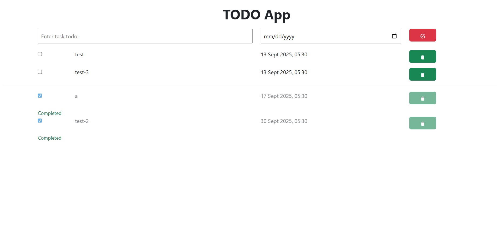
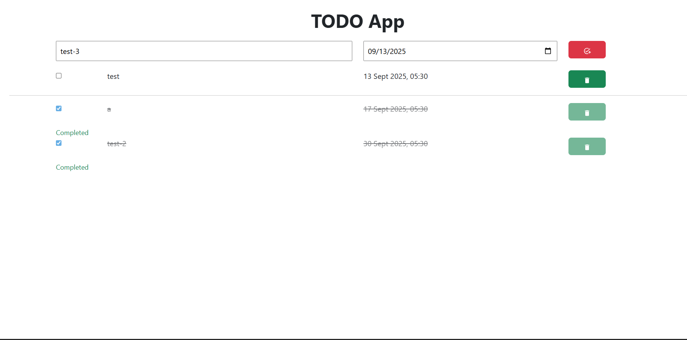

# ✅ MERN Todo App

A full-stack **Todo application** built using the **MERN stack (MongoDB, Express, React, Node.js)**.  
Users can create, read, update, and delete tasks.

Deployed with:

- **Backend** → Render
- **Frontend** → Vercel

---

## 🚀 Live Demo

- Frontend: [https://mern-todo-app-git-main-vinaya-neeharikas-projects.vercel.app](https://mern-todo-app-git-main-vinaya-neeharikas-projects.vercel.app)
- Backend: [https://mern-todo-app-o45p.onrender.com](https://mern-todo-app-o45p.onrender.com)

---

## 🖼 Screenshots

### Homepage



### Adding a Todo



---

## 🛠️ Tech Stack

- **Frontend**: React, Vite, BootstrapCSS
- **Backend**: Node.js, Express
- **Database**: MongoDB Atlas
- **Deployment**: Vercel (frontend), Render (backend)

---

## 📂 Project Structure

```
mern-todo-app/
│
├── client/              # React frontend (Vite)
│   ├── src/
│   └── package.json
│
├── server/              # Express backend
│   ├── routes/
│   ├── models/
│   ├── controllers/
│   ├── app.js
│   └── package.json
│
├── .gitignore
├── README.md
└── screenshots/

```

---

## ⚙️ Setup Instructions

### 1. Clone the Repository

```bash
git clone https://github.com/VNeeha/mern-todo-app.git
cd mern-todo-app
```

### 2. Backend Setup

```bash
cd server
npm install
```

Create a `.env` file:

```env
MONGO_URL=your_mongodb_connection_string
PORT=3000
```

Start backend locally (with auto-reload):

```bash
npm run dev
```

For production/deployed backend:

```bash
npm start
```

### 3. Frontend Setup

```bash
cd ../client
npm install
```

Create `.env` file:

```env
VITE_API_URL=http://localhost:3000/api/todos
```

Run frontend:

```bash
npm run dev
```

---

## 🌐 Deployment

### Backend (Render)

- Push backend code to GitHub
- Connect repo to Render
- Add environment variables (`MONGO_URL`, `PORT`)
- Deploy

### Frontend (Vercel)

- Push frontend code to GitHub
- Connect repo to Vercel
- Deploy
